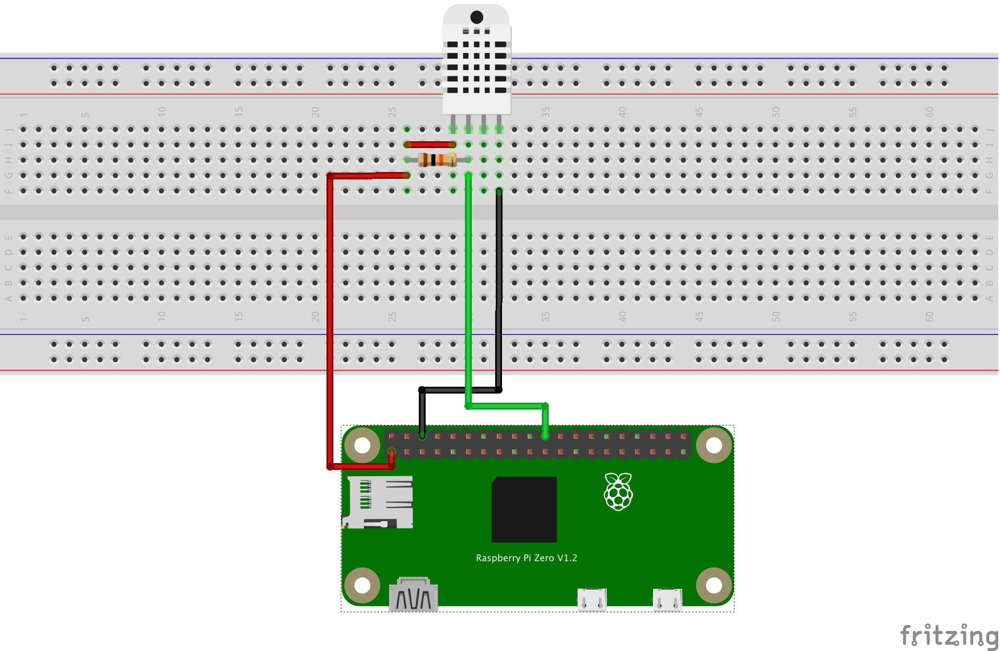

# MQTT via TLS/SSL

This is a small example project to test connections via TLS from a Python program to a MQTT server (mosquitto).

Clone source using `git clone https://github.com/bjarne-hansen/mqtt-ssl-test.git`.

Enter the directory `mqtt-ssl-test` and create a virtual environment:

```bash
$ python -m virtualenv venv
$ source venv/bin/activate
$ python -m pip install -r requirements
```

Each Python scrip uses environment variables `MQTT_HOST`, `MQTT_PORT`, `MQTT_USER`, and `MQTT_PWD` for connecting to an MQTT server.  These must be set with `export MQTT_HOST=...`(Linux/Mac) or `set MQTT_HOST=...` (Windows).

**PLEASE NOTE**: The scripts establish a TLS connection to the server and uses the `etc/trusted-ca.crt` certificate file.  The Base64 encoded certificate in that file **must** match the root certificate on the server you are accessing.  The one currently in the `etc/trusted-ca.crt` file is "DigiCert Global Root CA" which may or may not match what you need.  Make sure to replace it with the root certificate of your server.

Python scripts:
* `src/publish.py` - publish static message to topic iot/device/havreholm-indoor/data
* `src/subscribe.py` - subscribes to messages on topic iot/device/havreholm-indoor/#
* `src/read_dht.py` - simple test to read DHT22 sensor.
* `src/publish_dht.py` - publish sensor readings to iot/device/havreholm-indoor/data

You may want to change the topics for your own purpose.

The simple DHT22 setup used in the last 3 scripts:



Background information can be found here:
* [mosquitto.conf](https://mosquitto.org/man/mosquitto-conf-5.html)
* [Digital Ocean on Installing Secure Mosquitto on Debian](https://www.digitalocean.com/community/tutorials/how-to-install-and-secure-the-mosquitto-mqtt-messaging-broker-on-debian-10)
* [Steves Internet Guide on Mosquitto with TLS](http://www.steves-internet-guide.com/mosquitto-tls/)
* [Article on Medium about Mosquitto ACLs](https://medium.com/jungletronics/mosquitto-acls-ac062aea3f9)
* [StackExchange information on certificates](https://unix.stackexchange.com/questions/368123/how-to-extract-the-root-ca-and-subordinate-ca-from-a-certificate-chain-in-linux)
* [The pigpiod GPIO Service](http://abyz.me.uk/rpi/pigpio/pigpiod.html)
* [Paho MQTT Client on PyPi](https://pypi.org/project/paho-mqtt/)
* [DHT 11/22 Sensor Library on PyPi](https://pypi.org/project/pigpio-dht/)
* [Python Client for pigpiod on PyPi](https://pypi.org/project/pigpio/)
* [Paho Python MQTT Client Documentation](https://www.eclipse.org/paho/index.php?page=clients/python/docs/index.php)


Best regards,  
Bjarne
